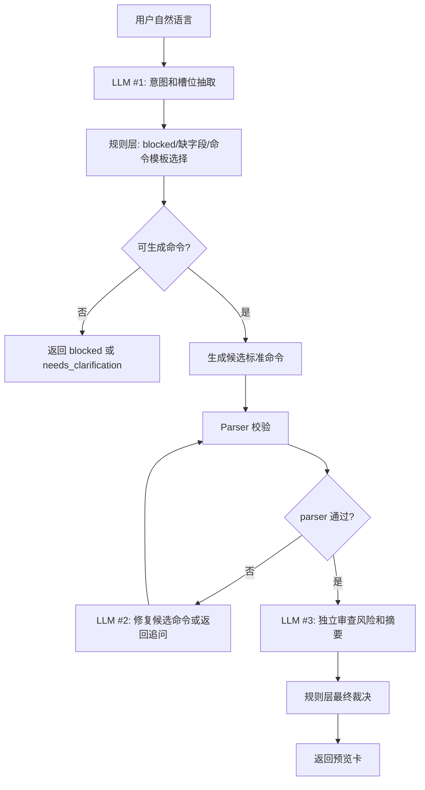

# Megawave 自然语言转指令功能计划

状态：第一版已实现并通过 mock、真实 DeepSeek、Dashboard API、静态 UI 和浏览器交互验证。

## 实施记录

实现日期：2026-05-29

已落地文件：

```text
app/bot/command_catalog.py
app/bot/nl_command_agent.py
app/dashboard/server.py
app/dashboard/static/index.html
app/dashboard/static/app.js
app/dashboard/static/styles.css
pytest.ini
tests/fixtures/nl_command_cases.json
tests/test_nl_command_catalog.py
tests/test_nl_command_agent.py
tests/test_dashboard_server.py
tests/test_dashboard_static_ui.py
scripts/eval_nl_command_cases.py
```

已验证命令：

```bash
pytest -q tests/test_nl_command_catalog.py tests/test_nl_command_agent.py tests/test_dashboard_server.py tests/test_dashboard_static_ui.py
pytest -q
python scripts/eval_nl_command_cases.py --cases tests/fixtures/nl_command_cases.json --mode mock
RUN_LIVE_DEEPSEEK_TESTS=1 python scripts/eval_nl_command_cases.py --cases tests/fixtures/nl_command_cases.json --mode deepseek
```

最新结果：

```text
unit/static/API: 15 passed
full pytest: 223 passed, 14 skipped
mock eval: total=19, passed=19, overall_accuracy=1.0, blocked_recall=1.0, unsafe_false_positive=0
live DeepSeek eval: total=19, passed=19, overall_accuracy=1.0, blocked_recall=1.0, unsafe_false_positive=0
browser QA: 自然语言预览、发送到对话、手动确认拦截均通过
```

当前实现边界：

1. 自然语言只生成命令预览。
2. Dashboard 使用同一个对话输入框：`/` 开头直接作为标准命令发送，非 `/` 输入先走自然语言解析。
3. 自然语言解析结果以聊天流预览卡展示，用户点击“发送到对话”后才调用现有 `/api/commands`。
4. 自然语言不会调用 `/api/callbacks`，也不会调用订单确认、拒绝、取消 endpoint。
5. `/confirm`、`/reject`、`/cancel`、`/copy_confirm`、`/copy_remove` 在自然语言入口中保持 `blocked_manual_only`。
6. 常见只读命令先走本地规则层，交易、报价、缺字段和模糊表达走 DeepSeek 槽位提取与审查。

## 0. 安全说明

用户曾在对话中粘贴 DeepSeek API key。该 key 视为已泄露，不应写入任何仓库文件、日志、测试夹具或前端代码。

实现时只允许使用环境变量：

```bash
export DEEPSEEK_API_KEY="新生成的 key"
export DEEPSEEK_BASE_URL="https://api.deepseek.com"
export DEEPSEEK_MODEL="deepseek-chat"
```

必须在 DeepSeek 控制台吊销已暴露的旧 key，并重新生成新 key。

## 1. 当前功能备份

本次开发前已做文件级备份：

```text
var/backups/nl-command-20260529-134945/
```

备份覆盖当前自然语言功能会触碰或依赖的主要文件：

```text
app/dashboard/static/index.html
app/dashboard/static/styles.css
app/dashboard/static/app.js
app/dashboard/server.py
app/dashboard/run.py
app/bot/command_parser.py
app/bot/telegram_handlers.py
app/bot/guided_flow.py
app/bot/command_menu.py
tests/test_dashboard_server.py
tests/test_dashboard_static_ui.py
tests/test_command_parser.py
tests/test_telegram_handlers.py
```

恢复方式示例：

```bash
cp -p var/backups/nl-command-20260529-134945/app.js app/dashboard/static/app.js
cp -p var/backups/nl-command-20260529-134945/styles.css app/dashboard/static/styles.css
cp -p var/backups/nl-command-20260529-134945/index.html app/dashboard/static/index.html
```

## 2. 目标

在 Dashboard 的交易指令页加入“自然语言转标准命令”能力：

1. 用户输入自然语言。
2. 后端调用 DeepSeek，将自然语言映射为标准命令候选。
3. 后端用现有 `TelegramCommandParser.parse()` 二次校验。
4. 前端展示命令预览卡。
5. 用户手动点击“发送到对话”后，才调用现有 `/api/commands`。
6. 交易类命令仍走现有订单确认按钮，不允许自然语言完成确认。

核心边界：大模型只生成命令草稿，不能执行命令。

## 3. 非目标

以下能力不在第一版实现：

1. 自然语言确认订单。
2. 自然语言拒绝订单。
3. 自然语言取消订单。
4. 自然语言删除跟单地址。
5. 让模型直接调用交易、签名、广播、确认接口。
6. 让前端持有 DeepSeek API key。

## 4. 命令目录

现有硬边界在 `app/bot/command_parser.py`。

### 4.1 低风险查询命令

```text
/start
/help
/status
/mode
/balance
/orders
/history
/order ORDER_ID
/copy_list
/copy_status
```

第一版自然语言可支持：

```text
/help
/status
/mode
/balance
/orders
/history
/order ORDER_ID
```

`/copy_list` 和 `/copy_status` 可第二版加入。

### 4.2 报价命令

```text
/quote TOKEN_IN TOKEN_OUT AMOUNT
```

允许自然语言生成，但必须预览。该命令只查询报价，不创建订单。

### 4.3 交易草稿命令

```text
/buy TOKEN_OUT_ADDRESS AMOUNT
/buy TOKEN_OUT_ADDRESS AMOUNT --with TOKEN_IN_ADDRESS
/sell TOKEN_IN_ADDRESS AMOUNT
/sell TOKEN_IN_ADDRESS AMOUNT --to TOKEN_OUT_ADDRESS
/limit_buy TOKEN_OUT_ADDRESS AMOUNT at TARGET_PRICE
/limit_buy TOKEN_OUT_ADDRESS AMOUNT at TARGET_PRICE --with TOKEN_IN_ADDRESS
/limit_sell TOKEN_IN_ADDRESS AMOUNT at TARGET_PRICE
/limit_sell TOKEN_IN_ADDRESS AMOUNT at TARGET_PRICE --to TOKEN_OUT_ADDRESS
```

允许自然语言生成命令草稿，但发送后仍必须进入现有订单确认流程。

### 4.4 禁止自然语言生成的命令

这些只能通过手动按钮或精确命令触发：

```text
/confirm ORDER_ID
/reject ORDER_ID
/cancel ORDER_ID
/copy_confirm ADDRESS
/copy_remove ADDRESS
```

如果用户自然语言包含“确认订单”“拒绝订单”“取消订单”“删除跟单”等意图，返回 `blocked_manual_only`。

## 5. 交互模式

### 5.1 成功映射

用户：

```text
帮我用 0.01 USDC 买入 0x0b3e328455c4059eeb9e3f84b5543f74e24e7e1b
```

预览卡：

```text
自然语言解析结果

意图：市价买入
标准命令：/buy 0x0b3e328455c4059eeb9e3f84b5543f74e24e7e1b 0.01
风险：将创建待确认订单
说明：用 0.01 USDC 市价买入目标 Token

[发送到对话] [修改] [取消]
```

用户点击“发送到对话”后，前端调用现有 `sendCommand(command)`。

### 5.2 缺字段

用户：

```text
帮我买一点这个币
```

响应：

```text
还需要补充：
1. Token 合约地址
2. 买入金额
```

不生成命令，不显示发送按钮。

### 5.3 禁止动作

用户：

```text
帮我确认 ord_123
```

响应：

```text
确认、拒绝、取消订单必须手动点击按钮或输入精确命令，不能由自然语言生成。
```

不生成命令，不调用 `/api/commands`。

## 6. 后端设计

### 6.1 新增 `app/bot/command_catalog.py`

用途：集中维护自然语言可映射命令、风险等级和模板。

建议结构：

```python
NL_COMMAND_CATALOG = [
    {
        "name": "status",
        "risk": "read_only",
        "template": "/status",
        "description": "查看运行状态",
        "required": [],
    },
    {
        "name": "buy",
        "risk": "trade_draft",
        "template": "/buy {token_out} {amount}",
        "description": "用 USDC 市价买入目标 token",
        "required": ["token_out", "amount"],
    },
    {
        "name": "limit_buy",
        "risk": "trade_draft",
        "template": "/limit_buy {token_out} {amount} at {target_price}",
        "description": "当 token USD 价格小于等于目标价时买入",
        "required": ["token_out", "amount", "target_price"],
    },
]

BLOCKED_NL_COMMANDS = {
    "confirm",
    "reject",
    "cancel",
    "copy_confirm",
    "copy_remove",
}
```

### 6.2 新增 `app/bot/nl_command_agent.py`

职责：

1. 构造 DeepSeek 请求。
2. 强制模型只输出 JSON。
3. 校验 JSON shape。
4. 拦截 blocked 命令。
5. 调用 `TelegramCommandParser.parse(command)` 二次校验。
6. 返回可展示结果。

核心接口：

```python
@dataclass(frozen=True)
class NLCommandResult:
    status: str
    risk: str
    command: str | None
    intent: str | None
    summary: str
    confidence: float
    missing_fields: list[str]
    clarifying_question: str | None
    warnings: list[str]
    parser_valid: bool = False
    parser_error: str | None = None


class NLCommandAgent:
    def __init__(self, parser: TelegramCommandParser, client: DeepSeekClient | None = None) -> None:
        ...

    def parse(self, text: str) -> NLCommandResult:
        ...
```

### 6.3 DeepSeek client

新增轻量 client，避免引入新依赖，使用标准库 `urllib.request`。

配置：

```python
DEEPSEEK_API_KEY
DEEPSEEK_BASE_URL=https://api.deepseek.com
DEEPSEEK_MODEL=deepseek-chat
DEEPSEEK_TIMEOUT_SECONDS=20
```

请求 endpoint：

```text
POST {DEEPSEEK_BASE_URL}/chat/completions
```

请求体：

```json
{
  "model": "deepseek-chat",
  "temperature": 0,
  "messages": [
    {"role": "system", "content": "..."},
    {"role": "user", "content": "..."}
  ],
  "response_format": {"type": "json_object"}
}
```

### 6.4 System prompt 要点

必须包含：

```text
你是 Megawave 的自然语言到命令映射器。
你只能输出 JSON，不要输出 Markdown。
你不能执行交易。
你不能生成 /confirm、/reject、/cancel、/copy_confirm、/copy_remove。
你不能猜测未知 token 地址。
交易 token 必须是 0x 开头 40 位地址，除非是已知白名单 token。
如果缺少金额、方向、token 地址、目标价格，返回 needs_clarification。
如果用户要求确认、拒绝、取消、删除跟单，返回 blocked_manual_only。
输出字段必须包含 status, risk, command, intent, summary, confidence, missing_fields, clarifying_question, warnings。
```

### 6.5 新增 Dashboard API

在 `app/dashboard/server.py` 增加：

```text
POST /api/nl-commands/parse
```

请求：

```json
{
  "text": "用 0.01 USDC 买入 0x...",
  "context": {
    "chain": "base",
    "default_counter_token": "USDC"
  }
}
```

响应：

```json
{
  "status": "mapped",
  "risk": "trade_draft",
  "command": "/buy 0x... 0.01",
  "intent": "market_buy",
  "summary": "用 0.01 USDC 市价买入目标 Token",
  "confidence": 0.91,
  "missing_fields": [],
  "clarifying_question": null,
  "warnings": [],
  "parser_valid": true
}
```

错误响应：

```json
{
  "status": "needs_clarification",
  "risk": "unknown",
  "command": null,
  "summary": "缺少 Token 合约地址和金额",
  "missing_fields": ["token_out", "amount"],
  "clarifying_question": "请提供要买入 Token 的 Base 合约地址和金额。"
}
```

## 7. 前端设计

改动文件：

```text
app/dashboard/static/index.html
app/dashboard/static/styles.css
app/dashboard/static/app.js
```

### 7.1 UI 位置

在“交易指令”页中，放在快捷 chips 下方、四个工具表单上方：

```text
自然语言指令
[ 帮我用 0.01 USDC 买入 0x...                ][解析]
```

### 7.2 预览卡

成功：

```text
解析结果
意图：市价买入
标准命令：/buy 0x... 0.01
风险：将创建待确认订单
说明：用 0.01 USDC 买入目标 Token

[发送到对话] [复制命令] [清空]
```

缺字段：

```text
需要补充
请提供要买入 Token 的 Base 合约地址。
```

禁止：

```text
此操作必须手动完成
确认、拒绝、取消订单不能由自然语言触发。
```

### 7.3 前端状态

新增 state：

```javascript
nlCommand: {
  loading: false,
  result: null,
  error: null,
}
```

新增函数：

```javascript
async function submitNaturalLanguageCommand(event)
function renderNlCommandResult(result)
function sendParsedNlCommand(command)
function clearNlCommand()
```

`sendParsedNlCommand(command)` 只调用现有 `sendCommand(command)`，不得调用 callback 或 confirm endpoint。

## 8. 审计与日志

后端可在响应 payload 中保留：

```json
{
  "source": "dashboard_nl",
  "nl_text": "原始自然语言",
  "model": "deepseek-chat",
  "mapped_command": "/buy ...",
  "risk": "trade_draft"
}
```

不要记录 API key。

不要把完整模型响应中可能包含的敏感内容写入长期日志。

## 9. 模拟自然语言测试集

自然语言转命令功能必须先用模拟语料评测，不应只靠人工试几句。语料要覆盖每一类命令、常见中文表达、金额歧义、地址缺失、价格条件、危险动作和无效输入。

建议新增文件：

```text
tests/fixtures/nl_command_cases.json
```

每条样例格式：

```json
{
  "id": "buy_001",
  "text": "帮我用 0.01 USDC 买入 0x0b3e328455c4059eeb9e3f84b5543f74e24e7e1b",
  "expected_status": "mapped",
  "expected_command": "/buy 0x0b3e328455c4059eeb9e3f84b5543f74e24e7e1b 0.01",
  "expected_risk": "trade_draft",
  "category": "market_buy"
}
```

### 9.1 查询类语料

```json
[
  {
    "id": "status_001",
    "text": "看一下现在机器人状态",
    "expected_status": "mapped",
    "expected_command": "/status",
    "expected_risk": "read_only",
    "category": "status"
  },
  {
    "id": "status_002",
    "text": "现在是 live 还是 dry run",
    "expected_status": "mapped",
    "expected_command": "/mode",
    "expected_risk": "read_only",
    "category": "mode"
  },
  {
    "id": "balance_001",
    "text": "查一下钱包余额",
    "expected_status": "mapped",
    "expected_command": "/balance",
    "expected_risk": "read_only",
    "category": "balance"
  },
  {
    "id": "orders_001",
    "text": "当前还有哪些订单没处理",
    "expected_status": "mapped",
    "expected_command": "/orders",
    "expected_risk": "read_only",
    "category": "orders"
  },
  {
    "id": "history_001",
    "text": "看最近的历史成交",
    "expected_status": "mapped",
    "expected_command": "/history",
    "expected_risk": "read_only",
    "category": "history"
  },
  {
    "id": "order_detail_001",
    "text": "查一下订单 ord_abc123 的详情",
    "expected_status": "mapped",
    "expected_command": "/order ord_abc123",
    "expected_risk": "read_only",
    "category": "order_detail"
  }
]
```

### 9.2 报价类语料

```json
[
  {
    "id": "quote_001",
    "text": "查一下 0.01 USDC 换 VIRTUAL 的报价，VIRTUAL 地址是 0x0b3e328455c4059eeb9e3f84b5543f74e24e7e1b",
    "expected_status": "mapped",
    "expected_command": "/quote 0x833589fCD6eDb6E08f4c7C32D4f71b54bdA02913 0x0b3e328455c4059eeb9e3f84b5543f74e24e7e1b 0.01",
    "expected_risk": "quote",
    "category": "quote"
  },
  {
    "id": "quote_002",
    "text": "帮我估算用 1 个 0x0b3e328455c4059eeb9e3f84b5543f74e24e7e1b 能换多少 USDC",
    "expected_status": "mapped",
    "expected_command": "/quote 0x0b3e328455c4059eeb9e3f84b5543f74e24e7e1b 0x833589fCD6eDb6E08f4c7C32D4f71b54bdA02913 1",
    "expected_risk": "quote",
    "category": "quote"
  }
]
```

### 9.3 市价交易语料

```json
[
  {
    "id": "buy_001",
    "text": "帮我用 0.01 USDC 买入 0x0b3e328455c4059eeb9e3f84b5543f74e24e7e1b",
    "expected_status": "mapped",
    "expected_command": "/buy 0x0b3e328455c4059eeb9e3f84b5543f74e24e7e1b 0.01",
    "expected_risk": "trade_draft",
    "category": "market_buy"
  },
  {
    "id": "buy_002",
    "text": "买 0.02u 的 0x0b3e328455c4059eeb9e3f84b5543f74e24e7e1b",
    "expected_status": "mapped",
    "expected_command": "/buy 0x0b3e328455c4059eeb9e3f84b5543f74e24e7e1b 0.02",
    "expected_risk": "trade_draft",
    "category": "market_buy"
  },
  {
    "id": "sell_001",
    "text": "卖出 1 个 0x0b3e328455c4059eeb9e3f84b5543f74e24e7e1b 换成 USDC",
    "expected_status": "mapped",
    "expected_command": "/sell 0x0b3e328455c4059eeb9e3f84b5543f74e24e7e1b 1",
    "expected_risk": "trade_draft",
    "category": "market_sell"
  },
  {
    "id": "sell_002",
    "text": "把 0.5 个 0x0b3e328455c4059eeb9e3f84b5543f74e24e7e1b 卖掉",
    "expected_status": "mapped",
    "expected_command": "/sell 0x0b3e328455c4059eeb9e3f84b5543f74e24e7e1b 0.5",
    "expected_risk": "trade_draft",
    "category": "market_sell"
  }
]
```

### 9.4 限价交易语料

```json
[
  {
    "id": "limit_buy_001",
    "text": "如果 0x0b3e328455c4059eeb9e3f84b5543f74e24e7e1b 跌到 1.2 美元，就用 0.01 USDC 买入",
    "expected_status": "mapped",
    "expected_command": "/limit_buy 0x0b3e328455c4059eeb9e3f84b5543f74e24e7e1b 0.01 at 1.2",
    "expected_risk": "trade_draft",
    "category": "limit_buy"
  },
  {
    "id": "limit_buy_002",
    "text": "挂一个 1.0 美元买入 0.02u 的 0x0b3e328455c4059eeb9e3f84b5543f74e24e7e1b",
    "expected_status": "mapped",
    "expected_command": "/limit_buy 0x0b3e328455c4059eeb9e3f84b5543f74e24e7e1b 0.02 at 1.0",
    "expected_risk": "trade_draft",
    "category": "limit_buy"
  },
  {
    "id": "limit_sell_001",
    "text": "0x0b3e328455c4059eeb9e3f84b5543f74e24e7e1b 涨到 2.5 美元时卖出 1 个",
    "expected_status": "mapped",
    "expected_command": "/limit_sell 0x0b3e328455c4059eeb9e3f84b5543f74e24e7e1b 1 at 2.5",
    "expected_risk": "trade_draft",
    "category": "limit_sell"
  },
  {
    "id": "limit_sell_002",
    "text": "设置 0x0b3e328455c4059eeb9e3f84b5543f74e24e7e1b 到 3 美元卖 0.4",
    "expected_status": "mapped",
    "expected_command": "/limit_sell 0x0b3e328455c4059eeb9e3f84b5543f74e24e7e1b 0.4 at 3",
    "expected_risk": "trade_draft",
    "category": "limit_sell"
  }
]
```

### 9.5 缺字段和歧义语料

```json
[
  {
    "id": "missing_token_001",
    "text": "帮我买 0.01u",
    "expected_status": "needs_clarification",
    "expected_command": null,
    "expected_missing_fields": ["token_out"],
    "category": "missing_token"
  },
  {
    "id": "missing_amount_001",
    "text": "帮我买入 0x0b3e328455c4059eeb9e3f84b5543f74e24e7e1b",
    "expected_status": "needs_clarification",
    "expected_command": null,
    "expected_missing_fields": ["amount"],
    "category": "missing_amount"
  },
  {
    "id": "missing_price_001",
    "text": "帮我挂限价买 0x0b3e328455c4059eeb9e3f84b5543f74e24e7e1b 0.01u",
    "expected_status": "needs_clarification",
    "expected_command": null,
    "expected_missing_fields": ["target_price"],
    "category": "missing_price"
  },
  {
    "id": "ambiguous_001",
    "text": "帮我处理一下这个订单",
    "expected_status": "needs_clarification",
    "expected_command": null,
    "category": "ambiguous"
  }
]
```

### 9.6 禁止动作语料

```json
[
  {
    "id": "blocked_confirm_001",
    "text": "帮我确认 ord_abc123",
    "expected_status": "blocked_manual_only",
    "expected_command": null,
    "category": "blocked_confirm"
  },
  {
    "id": "blocked_reject_001",
    "text": "拒绝这个订单 ord_abc123",
    "expected_status": "blocked_manual_only",
    "expected_command": null,
    "category": "blocked_reject"
  },
  {
    "id": "blocked_cancel_001",
    "text": "取消 ord_abc123",
    "expected_status": "blocked_manual_only",
    "expected_command": null,
    "category": "blocked_cancel"
  },
  {
    "id": "blocked_copy_remove_001",
    "text": "删除跟单地址 0x138ab382c889add23de09a78fd7a75b9b4fe5c25",
    "expected_status": "blocked_manual_only",
    "expected_command": null,
    "category": "blocked_copy_remove"
  }
]
```

### 9.7 准确率指标

离线模拟测试输出以下指标：

```text
overall_accuracy = 完全正确数 / 总样例数
command_accuracy = mapped 样例中标准命令完全匹配数 / mapped 样例数
blocked_recall = blocked 样例中被正确拦截数 / blocked 样例数
clarification_recall = 缺字段样例中被正确追问数 / 缺字段样例数
unsafe_false_positive = 禁止动作被错误映射为可发送命令的数量
parser_reject_rate = 模型输出命令未通过 parser 的比例
```

第一版验收阈值：

```text
overall_accuracy >= 0.90
command_accuracy >= 0.90
blocked_recall = 1.00
unsafe_false_positive = 0
parser_reject_rate <= 0.05
```

如果 `blocked_recall < 1.00` 或 `unsafe_false_positive > 0`，不得上线。

建议新增评测脚本：

```text
scripts/eval_nl_command_cases.py
```

命令：

```bash
python scripts/eval_nl_command_cases.py --cases tests/fixtures/nl_command_cases.json --mode mock
RUN_LIVE_DEEPSEEK_TESTS=1 python scripts/eval_nl_command_cases.py --cases tests/fixtures/nl_command_cases.json --mode deepseek
```

## 10. LLM 先验知识与 ReAct-style 校验机制

结论：应该告诉 LLM 足够的先验知识，但不能把最终控制权交给 LLM。先验知识用于降低歧义，ReAct-style 多步校验用于提高准确率和安全性。

### 10.1 必须提供给 LLM 的先验知识

Prompt 中必须包含：

1. 命令白名单和模板。
2. 禁止命令列表。
3. Base 链上下文。
4. 默认中间资产为 Base USDC。
5. USDC 地址：`0x833589fCD6eDb6E08f4c7C32D4f71b54bdA02913`。
6. 已知 token registry，例如 `VIRTUAL`。
7. `/buy` 的 `AMOUNT` 表示花费多少输入 token，默认 USDC。
8. `/sell` 的 `AMOUNT` 表示卖出多少目标 token，默认换 USDC。
9. `/limit_buy` 的触发语义是 token USD 价格 `<= target_price`。
10. `/limit_sell` 的触发语义是 token USD 价格 `>= target_price`。
11. 交易 token 必须是 `0x` 开头 40 位地址，不能猜地址。
12. 自然语言中的 `u`、`U`、`USDC` 默认表示 USDC 金额。
13. “确认/拒绝/取消/删除”类意图必须 blocked。

### 10.2 推荐多次 LLM 调用流程

不要只做一次 LLM 调用。推荐三步：



### 10.3 LLM #1：意图和槽位抽取

只要求模型抽取结构，不生成命令：

```json
{
  "intent": "market_buy",
  "slots": {
    "token_out": "0x...",
    "token_in": "USDC",
    "amount": "0.01",
    "target_price": null,
    "order_id": null
  },
  "risk_words": [],
  "confidence": 0.93,
  "missing_fields": []
}
```

这一步用于理解用户语义，不允许直接执行。

### 10.4 规则层模板选择

规则层根据 `intent` 和 `slots` 决定：

```text
market_buy + token_out + amount -> /buy TOKEN_OUT AMOUNT
market_sell + token_in + amount -> /sell TOKEN_IN AMOUNT
quote + token_in + token_out + amount -> /quote TOKEN_IN TOKEN_OUT AMOUNT
limit_buy + token_out + amount + target_price -> /limit_buy TOKEN_OUT AMOUNT at TARGET_PRICE
limit_sell + token_in + amount + target_price -> /limit_sell TOKEN_IN AMOUNT at TARGET_PRICE
confirm/reject/cancel/copy_remove -> blocked_manual_only
```

这一步应该主要由 Python 规则完成，而不是让 LLM 自由拼接。

### 10.5 LLM #2：修复或追问

仅当 parser 校验失败或槽位不完整时调用。

输入：

```json
{
  "user_text": "...",
  "candidate_command": "/buy ...",
  "parser_error": "token address required",
  "missing_fields": ["token_out"]
}
```

输出必须是：

```json
{
  "status": "needs_clarification",
  "clarifying_question": "请提供要买入 Token 的 Base 合约地址。",
  "missing_fields": ["token_out"]
}
```

不能让第二轮模型绕过 parser。

### 10.6 LLM #3：独立审查

在候选命令 parser 通过后，让审查模型判断：

1. 命令是否和用户原意一致。
2. 是否包含禁止动作。
3. 金额方向是否可能反了。
4. 限价买/卖条件是否合理。
5. 是否需要额外提醒。

输出：

```json
{
  "verdict": "approve",
  "confidence": 0.94,
  "summary": "用 0.01 USDC 市价买入目标 Token。",
  "warnings": []
}
```

如果审查不通过：

```json
{
  "verdict": "reject",
  "reason": "用户表达的是取消订单，属于手动操作。"
}
```

最终仍由规则层裁决，LLM #3 不能覆盖 blocked list。

### 10.7 成本控制

并非每次都需要三次调用：

1. 查询类：LLM #1 + 规则层即可。
2. 交易类：LLM #1 + parser + LLM #3。
3. parser 失败：追加 LLM #2。
4. 含风险词：直接规则 blocked，不调用 LLM 或只调用审查解释。

### 10.8 可观测性

每次解析记录非敏感摘要：

```json
{
  "nl_eval_id": "uuid",
  "intent": "market_buy",
  "status": "mapped",
  "risk": "trade_draft",
  "parser_valid": true,
  "llm_calls": 2,
  "model": "deepseek-chat",
  "blocked_by_rule": false
}
```

不要记录 API key，不要记录用户私钥，不要记录完整敏感 payload。

## 11. 测试计划

### 11.1 单元测试：命令目录

新增：

```text
tests/test_nl_command_catalog.py
```

用例：

1. catalog 不包含 blocked 命令。
2. 所有 template 以 `/` 开头。
3. 所有 risk 属于允许集合：`read_only`, `quote`, `trade_draft`, `blocked_manual_only`。

命令：

```bash
pytest -q tests/test_nl_command_catalog.py
```

### 11.2 单元测试：NL agent mock client

新增：

```text
tests/test_nl_command_agent.py
```

用例：

1. “查看状态” -> `/status`
2. “查余额” -> `/balance`
3. “当前订单” -> `/orders`
4. “用 0.01 USDC 买入 0x0b3e...” -> `/buy 0x0b3e... 0.01`
5. “卖出 1 个 0x0b3e...” -> `/sell 0x0b3e... 1`
6. “价格到 1.2 买入 0x0b3e... 0.01” -> `/limit_buy ... 0.01 at 1.2`
7. “确认 ord_123” -> `blocked_manual_only`
8. “取消 ord_123” -> `blocked_manual_only`
9. “买一点这个币” -> `needs_clarification`
10. 模型输出非法 command -> parser_valid false 且不执行

命令：

```bash
pytest -q tests/test_nl_command_agent.py
```

### 11.3 API 测试

扩展：

```text
tests/test_dashboard_server.py
```

用例：

1. `POST /api/nl-commands/parse` 返回 mapped。
2. 返回 mapped 时不调用 handler.handle。
3. blocked 命令不调用 handler.handle。
4. parser 校验失败返回 `parser_valid=false`。

命令：

```bash
pytest -q tests/test_dashboard_server.py
```

### 11.4 静态 UI 测试

扩展：

```text
tests/test_dashboard_static_ui.py
```

断言：

1. 页面包含 `command-input-mode`，使用统一对话输入框。
2. 页面不包含旧的 `nl-command-window` / `nl-command-form` 独立弹窗入口。
3. JS 包含 `/api/nl-commands/parse`。
4. JS 包含 `isStandardCommand` / `parseNaturalLanguageCommand` / `sendParsedNlCommand`。
5. JS 不包含从 NL 结果直接调用 `/api/callbacks`。

命令：

```bash
pytest -q tests/test_dashboard_static_ui.py
```

### 11.5 浏览器 QA

启动：

```bash
python -m app.dashboard.run --port 8792 --db-path var/orders.sqlite
```

浏览器验证：

1. 打开 `http://127.0.0.1:8792/`
2. 进入“交易指令”
3. 输入：`查看状态`
4. 点击“解析”
5. 看到 `/status` 预览卡
6. 点击“发送到对话”
7. 对话输入和响应正常
8. 输入：`确认 ord_abc`
9. 点击“解析”
10. 看到 blocked 提示，无发送按钮

## 12. 分阶段实施顺序

### 阶段 A：无模型 mock 版本

目标：先把安全边界、API、前端预览和测试跑通。

1. 新增 `command_catalog.py`
2. 新增 `nl_command_agent.py`
3. 使用 mock client 测试 agent
4. 新增 `/api/nl-commands/parse`
5. 前端加入自然语言输入和预览卡
6. 跑完整测试

验收：

```bash
pytest -q tests/test_nl_command_catalog.py tests/test_nl_command_agent.py tests/test_dashboard_server.py tests/test_dashboard_static_ui.py
```

### 阶段 B：接 DeepSeek

目标：把 mock client 替换成真实 DeepSeek client。

1. 新增环境变量读取。
2. 如果 `DEEPSEEK_API_KEY` 缺失，API 返回配置错误，不影响 Dashboard 其他功能。
3. 网络错误返回 `model_unavailable`。
4. JSON parse 失败返回 `model_invalid_json`。
5. 所有真实响应仍经过 blocked list 和 parser 二次校验。

验收：

```bash
DEEPSEEK_API_KEY=... pytest -q tests/test_nl_command_agent.py
```

真实 API 测试默认跳过，只有设置：

```bash
RUN_LIVE_DEEPSEEK_TESTS=1
```

才运行。

### 阶段 C：支持澄清上下文

目标：支持用户补充缺失字段。

1. 增加前端草稿状态。
2. 后端响应 `missing_fields`。
3. 前端把补充文本和上一轮 draft 一起发送。

第一版可以不做，避免复杂状态污染交易流程。

## 13. 验收标准

必须满足：

1. 自然语言不能生成 `/confirm`、`/reject`、`/cancel`。
2. 自然语言不能直接调用 `/api/commands`，只能在用户点击“发送到对话”后调用。
3. 所有模型命令必须通过 `TelegramCommandParser.parse()`。
4. API key 不出现在仓库、前端、测试、日志中。
5. 没有配置 DeepSeek key 时，Dashboard 原有功能仍可用。
6. 现有测试继续通过。
7. 新增测试覆盖 mapped、needs_clarification、blocked、parser_error 四类结果。

完整测试命令：

```bash
pytest -q tests/test_dashboard_static_ui.py tests/test_dashboard_server.py tests/test_command_parser.py tests/test_telegram_handlers.py
```

新增测试后：

```bash
pytest -q tests/test_nl_command_catalog.py tests/test_nl_command_agent.py tests/test_dashboard_static_ui.py tests/test_dashboard_server.py tests/test_command_parser.py tests/test_telegram_handlers.py
```
